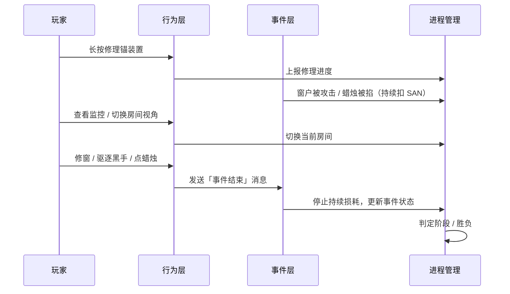

# CiGA2026 — 技术设计文档

> 基于《简易策划案》与行为 / 事件 / 进程管理三层架构整理。  
> 引擎：Godot 4.7 · 视角：房间内固定视角，可小角度旋转。

---

## 1. 概述

### 1.1 游戏定位

| 项 | 内容 |
|---|---|
| 类型 | 恐怖生存，类 FNAF / *These Darker Tides* |
| 视角 | 第一人称，**房间内固定机位**，支持小角度旋转环视 |
| 地图 | 抛锚船舱，**两个房间 + 走廊**（小地图点击切换，黑屏过渡） |
| 终极目标 | 在 SAN 值不归零的前提下，修好锚的回收装置并离开险境 |
| 核心循环 | 修理回收装置 → 怪物攻击 → 玩家应对 → 继续修理 |

### 1.2 设计立意

理智是「现实的锚点」，船锚是「地理的锚点」——玩家需要在不断侵蚀理智的海上险境中，守住两者。

### 1.3 文档范围

本文档描述**程序架构与系统设计**，美术规格以策划案「美术需求」章节为准，具体数值可在实现阶段微调。

---

## 2. 总体架构

系统分为三层，职责清晰、单向依赖：

```
┌─────────────────────────────────────────────────────────┐
│                    进程管理 (Process)                     │
│   GameProcessManager          RoomStateManager          │
│   · 阶段切换 (Phase 1 ↔ 2)     · 房间/窗户/蜡烛快照      │
│   · SAN / 胜负判定             · 当前视角房间              │
│   · 锚修理进度                 · 实体状态聚合              │
└──────────────────────────▲──────────────────────────────┘
                           │ 订阅状态变化 / 查询
┌──────────────────────────┴──────────────────────────────┐
│                      事件 (Event)                        │
│   WindowAttackEvent          CandleExtinguishEvent      │
│   · 发生 → 进行中 → 结束       · 发生 → 进行中 → 结束      │
│   · 驱动 SAN / 耐久持续损耗     · 驱动 SAN 持续损耗         │
└──────────────────────────▲──────────────────────────────┘
                           │ 行为完成时发送消息
┌──────────────────────────┴──────────────────────────────┐
│                      行为 (Behavior)                      │
│  SwitchCamera · FixWindow · ExpelBlackHand              │
│  LightCandle · RepairAnchorDevice                       │
│   · 玩家输入 + 读条/连点                                    │
│   · 完成后向对应 Event 发送结束消息                          │
└─────────────────────────────────────────────────────────┘
```

**依赖原则**

- **行为**只关心交互与本地进度，不直接修改全局 SAN 或阶段。
- **事件**负责「正在发生什么」及持续效果（按 `delta` 扣 SAN / 耐久）。
- **进程管理**持有权威状态，协调阶段、胜负、房间切换与 UI 数据源。

**通信方式（Godot 建议）**

- 进程管理：`Autoload` 单例（如 `GameManager`、`RoomManager`）。
- 事件：各 Event 为 `Node` 或 `Resource` + 信号；行为通过**消息对象**或**信号**通知事件状态变迁。
- 行为：挂载于可交互实体（窗户、蜡烛、控制台等）的 `Area3D` / 脚本组件。

---

## 3. 游戏阶段与胜负

### 3.1 阶段定义

| 阶段 | 进入条件 | 怪物行为 | 玩家主要应对 |
|---|---|---|---|
| **Phase 1**（窗外入侵） | 游戏开始 | 随机间隔攻击窗户，降低耐久 | 钉木板修窗 |
| **Phase 2**（屋内入侵） | **任一窗户耐久 = 0** | 黑手浮空靠近，≤15s 掐灭蜡烛 | 连点驱逐黑手 / 重燃蜡烛 |

阶段切换由 `GameProcessManager` 监听 `RoomStateManager` 的窗户耐久，触发 `phase_changed` 信号。

### 3.2 胜负条件

| 结果 | 条件 |
|---|---|
| **失败** | SAN 值 ≤ 0 |
| **胜利** | 锚回收装置累计修理时间 ≥ 60s，且 SAN > 0 |

### 3.3 核心循环时序



---

## 4. 视角与场景

### 4.1 固定视角 + 小角度旋转

- 每个房间预设 **1 个主摄像机机位**（Transform 固定）。
- 玩家可在机位上 **Yaw 小范围旋转**（建议 ±30°~±45°，具体手感调参），不进行自由行走。
- **切换房间**通过小地图按钮 → 黑屏过渡 → 加载目标房间机位（`SwitchCamera` 行为）。

### 4.2 场景布局（策划基线）

| 区域 | 内容 |
|---|---|
| 房间 A / B | 各 2 扇窗、2 根蜡烛 |
| 船头房间 | 锚回收装置控制台 |
| 公共 | 监控视角（查看怪物位置，具体 UI 待细化） |

### 4.3 房间切换行为 `SwitchCamera`

**输入**：小地图房间按钮 / 监控界面选择  
**效果**：

1. 播放短黑屏过渡（`Transition`）。
2. `RoomStateManager.current_room_id` 更新。
3. 激活目标房间 `Camera3D`，禁用其余房间相机。
4. 重置旋转角度至默认。

---

## 5. 行为层 (Behavior)

所有行为继承统一基类（示意）：

```gdscript
# BehaviorBase — 抽象交互：开始 / 更新 / 取消 / 完成
class_name BehaviorBase
# 完成时：emit behavior_completed(behavior_id, payload)
```

### 5.1 行为一览

| ID | 名称 | 触发方式 | 作用对象 | 完成后消息 |
|---|---|---|---|---|
| `switch_camera` | 切换镜头 | 点击小地图 | 房间 | 无（仅进程管理更新当前房间） |
| `fix_window` | 修窗 | 长按窗户 + 读条 | 窗户 | → `WindowAttackEvent.resolve(window_id)` |
| `expel_black_hand` | 驱逐黑手 | 连点黑手 | 蜡烛事件关联黑手 | → `CandleExtinguishEvent.resolve(candle_id)` |
| `light_candle` | 点燃蜡烛 | 长按读条（较短） | 蜡烛 | → 若因熄灭触发事件，则 `CandleExtinguishEvent.resolve` |
| `repair_anchor` | 修理回收装置 | 长按控制台读条 | 锚装置 | → 仅上报 `GameProcessManager.add_repair_time(dt)` |

### 5.2 修窗 `FixWindow`

- **前置**：目标窗户存在且耐久 < 100；Phase 1 下耐久为 0 的窗户**不可再修**（策划：耐久归零无法修复）。
- **过程**：窗户正下方显示读条；耐久 `+= 4 * delta(time)`。
- **并行**：若该窗正处于 `WindowAttackEvent` 中，攻击仍持续扣耐久（`-5 * delta`），修窗与攻击叠加计算。
- **完成**：读条结束或耐久满；若关联事件被「化解」（怪物离开），由事件层通知结束，行为可被打断。

### 5.3 点燃蜡烛 `LightCandle`

- 长按时间 **短于** 修窗 / 修锚。
- 将蜡烛 `lit = true`；若此前因 Phase 2 事件熄灭，重燃后参与 SAN 公式切换。

### 5.4 驱逐黑手 `ExpelBlackHand`

- **连点**黑手模型；每次点击触发「抽搐」动画，累计点击次数 ≥ N（建议 5~8，待调）后黑手消失。
- 完成 → 向 `CandleExtinguishEvent` 发送 resolve，蜡烛保持当前亮灭状态（若已灭则需玩家再 `LightCandle`）。

### 5.5 修理回收装置 `RepairAnchor`

- 船头房间控制台 **长按** 读条。
- 累计有效修理时间，达到 **60s** 触发胜利流程。
- 修理过程中玩家仍可能遭受事件攻击，不豁免 SAN 损耗。

---

## 6. 事件层 (Event)

事件统一生命周期：

```
Idle → Triggered → Active → Resolved / Failed
         ↑                    ↑
    怪物发起攻击          玩家行为发送消息
```

### 6.1 事件基类

```gdscript
# EventBase
enum State { IDLE, TRIGGERED, ACTIVE, RESOLVED, FAILED }

signal state_changed(event_id, old_state, new_state)
signal san_drain_requested(rate_multiplier)  # 由进程管理统一结算 SAN

func on_behavior_message(msg: BehaviorMessage) -> void
func tick(delta: float) -> void  # Active 状态下每帧调用
```

### 6.2 窗户攻击事件 `WindowAttackEvent`（Phase 1）

| 项 | 规格 |
|---|---|
| 触发 | 随机间隔（待定义范围，如 20~40s）选取一扇窗 |
| 持续时间 | **(8, 15]** 秒（左开右闭） |
| Active 效果 | 目标窗 `durability -= 5 * delta`；SAN `-1 * delta`（见 SAN 公式） |
| 结束条件 | 时间到 **或** 收到 `fix_window` resolve **或** 怪物逻辑「离开」（可合并为 resolve） |
| 监控 | 触发时在小地图 / 监控 UI 标记怪物位置（房间 + 窗索引） |

**BehaviorMessage 示例**

```gdscript
{ type = "fix_window", window_id = "room_a_window_1", resolved = true }
```

### 6.3 蜡烛掐灭事件 `CandleExtinguishEvent`（Phase 2）

| 项 | 规格 |
|---|---|
| 触发 | Phase 2 下随机选取一根 **lit** 的蜡烛 |
| 表现 | 黑手模型浮空并缓慢靠近，**最多 15s** 后掐灭 |
| Active 效果 | 在掐灭前 SAN 按 Phase 2 规则；掐灭后该蜡烛 `lit = false`，SAN `-5 * delta` |
| 结束条件 | 15s 到（Failed，蜡烛灭） **或** `expel_black_hand` / `light_candle` resolve |

**BehaviorMessage 示例**

```gdscript
{ type = "expel_black_hand", candle_id = "room_b_candle_2", resolved = true }
```

### 6.4 事件与行为的消息协议

建议使用轻量字典或 RefCounted 消息类，字段：

| 字段 | 说明 |
|---|---|
| `type` | 行为类型字符串 |
| `target_id` | 实体 ID |
| `resolved` | 是否视为化解事件 |
| `payload` | 可选扩展（如修窗恢复耐久量） |

事件收到 `resolved = true` 且 `target_id` 匹配当前 Active 目标 → 迁移至 `RESOLVED`，停止 `tick` 损耗。

---

## 7. 进程管理 (Process)

### 7.1 GameProcessManager

**职责**

- 维护 `game_phase`（1 / 2）、`san_current`、`san_max`、锚修理累计时间。
- 每帧聚合所有 Active 事件的 SAN 系数，计算 SAN 变化。
- 判定胜利 / 失败，发出 `game_over(reason)`。
- 驱动全局 UI（SAN 条、锚进度、阶段提示）。

**SAN 规则（策划基线）**

设 `dt = delta(time)`，每帧按条件**叠加**：

| 条件 | SAN 变化 / 帧 |
|---|---|
| 全部蜡烛亮着 | `+ dt * 1.5` |
| Phase 1 且某窗正被攻击 | `- dt * 1`（按事件实例计，不叠加多窗则单实例） |
| Phase 2 且任一蜡烛熄灭 | `- dt * 5` |

**SAN 上限变化**

- 初始 `san_max = 100`。
- **任一窗户耐久归零**后：`san_max = 80`（当前 SAN 若 > 80 则 clamp）。

### 7.2 RoomStateManager

**职责**

- 维护房间、窗户、蜡烛、锚装置的**权威数据**（见第 8 节）。
- 提供查询：`get_windows(room_id)`、`get_unbroken_window_count()`、`all_candles_lit()` 等。
- 响应行为层的状态写入（修窗、点蜡烛），并 `emit` 变更信号供 UI / 事件层订阅。
- 跟踪 `current_room_id` 与相机绑定关系。

**与阶段切换**

```gdscript
# 伪代码
func on_window_durability_changed(window):
    if window.durability <= 0 and game_phase == PHASE_1:
        GameProcessManager.enter_phase_2()
        GameProcessManager.set_san_max(80)
```

---

## 8. 数据模型

### 8.1 实体 ID 约定

```
room_a | room_b | room_bow
window_{room}_{index}    # 如 window_room_a_0
candle_{room}_{index}
anchor_device
black_hand_{candle_id}   # 事件表现用，非持久实体
```

### 8.2 窗户 WindowState

| 字段 | 类型 | 说明 |
|---|---|---|
| `id` | String | 唯一标识 |
| `room_id` | String | 所属房间 |
| `durability` | int | 当前耐久，max = 100 |
| `max_durability` | int | 100 |
| `is_broken` | bool | 耐久曾归零则 true，不可再修 |

### 8.3 蜡烛 CandleState

| 字段 | 类型 | 说明 |
|---|---|---|
| `id` | String | 唯一标识 |
| `room_id` | String | 所属房间 |
| `lit` | bool | 是否点燃 |

### 8.4 锚装置 AnchorDeviceState

| 字段 | 类型 | 说明 |
|---|---|---|
| `repair_time_accum` | float | 累计修理秒数 |
| `repair_time_target` | float | 60.0 |
| `is_repaired` | bool | 是否完成 |

### 8.5 玩家 / 进程快照 GameSnapshot

| 字段 | 类型 | 说明 |
|---|---|---|
| `phase` | int | 1 或 2 |
| `san` / `san_max` | float | 理智 |
| `current_room_id` | String | 当前视角房间 |
| `active_events` | Array | 当前进行中的事件 ID 列表 |

---

## 9. UI 设计

| 元素 | 数据源 | 说明 |
|---|---|---|
| SAN 值条 | `GameProcessManager` | 显示 current / max |
| 窗户耐久条 | 当前交互窗 / 被攻击窗 | 事件触发时高亮 |
| 锚修理进度 | `repair_time_accum / 60` | 船头或 HUD 常驻 |
| 读条进度条 | 各 Behavior 本地进度 | 窗下 / 屏幕中心 |
| 小地图 | `RoomStateManager` | 右下，两房间 + 玩家位置 + 点击切换 |
| 设置 | — | 音量、灵敏度等 |

---

## 10. 目录结构建议（Godot）

```
res://
├── autoload/
│   ├── game_process_manager.gd
│   └── room_state_manager.gd
├── behaviors/
│   ├── behavior_base.gd
│   ├── switch_camera.gd
│   ├── fix_window.gd
│   ├── expel_black_hand.gd
│   ├── light_candle.gd
│   └── repair_anchor.gd
├── events/
│   ├── event_base.gd
│   ├── window_attack_event.gd
│   ├── candle_extinguish_event.gd
│   └── event_scheduler.gd      # 随机间隔触发
├── scenes/
│   ├── rooms/
│   ├── props/                  # 窗、蜡烛、锚、黑手
│   └── ui/
├── data/
│   └── default_room_layout.tres
└── docs/
    └── DESIGN.md
```

---

## 11. 美术与资源（策划摘要）

| 类别 | 数量 / 说明 |
|---|---|
| 场景 | 两房间 + 走廊，低多边形 |
| 道具模型 | 窗、蜡烛、木板、锚 |
| 怪物 | 黑手 ×1，简易动画（靠近 + 掐灭） |
| UI | SAN、耐久、锚进度、读条、小地图、设置 |

---

## 12. 待确认项

| # | 问题 | 影响 |
|---|---|---|
| 1 | Phase 1 窗户攻击的随机间隔具体范围 | EventScheduler |
| 2 | 监控 UI 形式（静态图 / 简 live 视图） | 切换镜头与提示 |
| 3 | 驱逐黑手所需连点次数 N | ExpelBlackHand 平衡 |
| 4 | 相机旋转是否含 Pitch 或仅 Yaw | 输入与相机脚本 |
| 5 | 多扇窗同时被攻击是否允许 | 事件层并发策略 |
| 6 | 修窗读条单次时长 vs 耐久恢复速率 | FixWindow 手感 |

---

## 13. 实现里程碑

| 阶段 | 目标 |
|---|---|
| **M1** | 进程管理 + 空房间 + 固定相机与小角度旋转 + 房间切换 |
| **M2** | 窗户 / 蜡烛数据 + 修窗 / 点蜡烛行为 + UI 读条 |
| **M3** | WindowAttackEvent + SAN 公式 + Phase 1 循环 |
| **M4** | Phase 2 + CandleExtinguishEvent + 黑手驱逐 |
| **M5** | 锚修理 + 胜负流程 + 监控 / 小地图 polish |
| **M6** | 音效、跳跃 scare、数值与时长调优 |

---

## 14. 修订记录

| 版本 | 日期 | 说明 |
|---|---|---|
| 0.1 | 2026-07-04 | 初稿：行为 / 事件 / 进程管理三层架构 |
